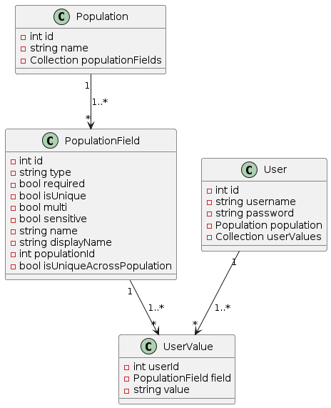

# User Manager
This project is a PHP-based web application that serves as an API for managing populations and users within those populations. It provides endpoints for retrieving population data and creating users associated with specific populations.



The rules to validate the user values are in the population fields.
[More info](support/php-tech-test.pdf)

## Front end Projec
The front end project can be found in https://github.com/arturhayne/user-manager-app

## Changes
It was added a new field in population_fields `is_unique_across_population` to validate if the field is unique across population.

Besides that, `email` and `employeeid` became `is_unique_across_population = true`.

Theses changes could be seen in [database/unique-across-population.sql](database/unique-across-population.sql).

The property of field uniqueness (isunique) within the population is still working as before.

## Unique across population

Validation query (in [SqliteUserValueRepository.php](https://github.com/arturhayne/user-manager/blob/main/src/Infrastructure/SqliteUserValueRepository.php#L31))
```
    SELECT count(1)
    FROM population_fields pf
    JOIN user_values uv ON uv.field_id = pf.id
    WHERE pf.is_unique_across_population = true
    AND pf.name = 'email'
    AND uv.value = 'jdoe@example.com'
```

1. Return all the population fields labeled as `email` and unique across population
2. Check if we have in the `user_values` table an email with value `jdoe@example.com` for the populations fields in the first step
3. if `count(1) > 0` there is already a value registered already

Note: 
 - The population field name must be the same for different populations
 - if the `is_unique_across_population` is false for certain population, even with same email value, it will not return

## Add User Flow


index -> UserController -> UserCommandHandler -> UserValuesValidationService -> Validator -> Repository

- UserCommandHandler uses UserRepository to retrieve the use information with population fields.
- UserValuesValidationService uses Validator to check if fields are unique across population and within population.

## Structure
The system is architectured following the Application, Domain, and Infrastructure structure, facilitating seamless logic migration to various system architectures. For instance, transitioning database structures to leverage an ORM or a different database system merely requires integrating a new implementation of the repositories. Similarly, the controllers are adaptable, allowing for alternative handling structures, such as encapsulation within a Composer package.

This is system was made without any framework and it is using the [Container](app/Container.php) class to provide dependecy injection, following SOLID principles.

## Validation

The core of validations are made in [Validator](src/Domain/Validator.php).

For any further type or additional validation, changes needs to be made there.

## Setup
1. docker-compose up -d
2. docker-compose exec web bash
3. composer install (inside the container)
4. php database/create-tables.php
5. php database/seed-tables.php
6. php database/update-population-fields.php (added new field is_unique_across_population and update email and emploeeid fields)

## Run
php -S 0.0.0.0:8070 (inside the container)

## Usage

`GET http://localhost:8070/population`
Retrieve the registered populations with the population fields.
```
[
    {
        "id": 1,
        "name": "Employees",
        "fields": [
            {
                "type": "text",
                "required": true,
                "isUnique": true,
                "multi": false,
                "sensitive": false,
                "name": "employeeid",
                "displayName": "Employee ID",
                "isUniqueAcrossPopulation": true
            },
            {
                "type": "text",
                "required": true,
                "isUnique": false,
                "multi": false,
                "sensitive": false,
                "name": "fname",
                "displayName": "First Name",
                "isUniqueAcrossPopulation": false
            },
        ]
    },
    {
        "id": 4,
        "name": "Freelancer",
        "fields": [
            {
                "type": "text",
                "required": true,
                "isUnique": false,
                "multi": false,
                "sensitive": false,
                "name": "fname",
                "displayName": "First Name",
                "isUniqueAcrossPopulation": false
            },
            {
                "type": "text",
                "required": true,
                "isUnique": false,
                "multi": false,
                "sensitive": false,
                "name": "lname",
                "displayName": "Last Name",
                "isUniqueAcrossPopulation": false
            },
            {
                "type": "email",
                "required": true,
                "isUnique": true,
                "multi": false,
                "sensitive": false,
                "name": "email",
                "displayName": "Email Address",
                "isUniqueAcrossPopulation": false
            }
        ]
    }
]
```

`POST http://localhost:8070/population/1/user` (where 1 is the population id)
Add user with user values.
Body Request:
```
{
  "user_name": "arturhayne",
  "password": "123456",
  "employeeid": "ABC123",
  "fname": "Artur",
  "lname": "Hayne",
  "bdate": "1983-10-10",
  "bplace": "Salvador",
  "email": "arturhayne@hotmail.com"
}
```
Success Response (200):
```
{
    "id": 3 
}
```

Bad Request Response (400):
```
{
    "status": 400,
    "error": {
        "employeeid": {
            "isUniqueAcrossPopulation": "Employeeid is not unique across population."
        },
        "email": {
            "isUniqueAcrossPopulation": "Email is not unique across population."
        }
    }
}
```


Curl
```
curl -X POST \
  http://localhost:8070/population/1/user \
  -H 'Content-Type: application/json' \
  -d '{
    "user_name": "arturhayne",
    "password": "123456",
    "employeeid": "A00513",
    "fname": "Jhon",
    "lname": "Doe",
    "bdate": "1994-01-23",
    "bplace": "Carignan, QC, Canada",
    "email": "jdoe@example.com"
  }'
```

### Code style
Using [oskarstark](https://github.com/OskarStark/php-cs-fixer-ga) to autofix phpcs
```
docker run --rm -it -w=/app -v ${PWD}:/app oskarstark/php-cs-fixer-ga:latest
```

### Tests
```
root@2a4e50ce95a7:/var/www/html# vendor/bin/phpunit --testdox
PHPUnit 10.5.20 by Sebastian Bergmann and contributors.

Runtime:       PHP 8.2.18
Configuration: /var/www/html/phpunit.xml

...........                                                       11 / 11 (100%)

Time: 00:00.207, Memory: 8.00 MB

Population Query Handler (Tests\Unit\PopulationQueryHandler)
 ✔ Execute returns correct dto

User Command Handler (UserManager\Tests\Application\UserCommandHandler)
 ✔ Execute creates user successfully
 ✔ Execute throws not found exception when population not found
 ✔ Execute throws user name already exists exception when user exists

User Values Validation Service (Tests\Unit\UserValuesValidationService)
 ✔ Should validate unique fields
 ✔ Should pass non unique fields
 ✔ Should validate unique across population
 ✔ Should pass non unique across population
 ✔ Without unique validation
 ✔ Email validation
 ✔ Date validation

OK (11 tests, 19 assertions)
```
Note: In a real system test scenario we should use a test database and populate it according to the test.
The system tests are using the data provided in \database\data.sql script. 

## Debug
Update `xdebug.start_with_request=no` to yes in xdebug.ini
